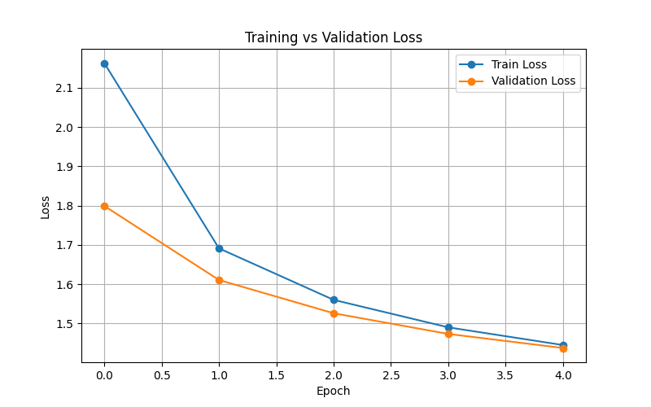
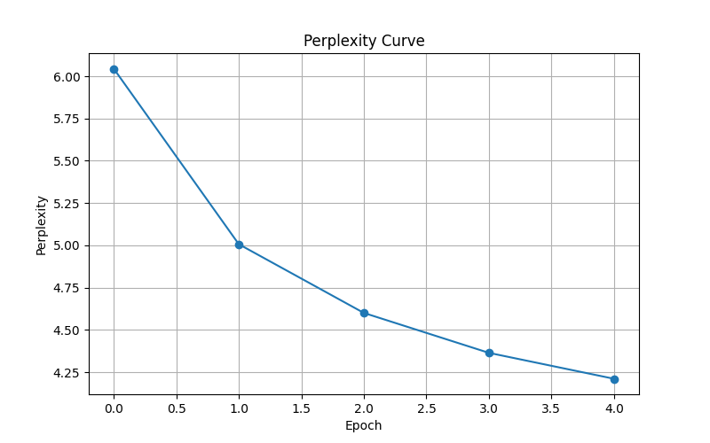

# RNN Corpus Explorer

A modular experimental framework for character-level neural language modeling using recurrent neural networks.

The project focuses on:

* recurrent sequence modeling
* autoregressive text generation
* NLP experimentation
* training visualization
* recurrent architecture comparison
* language model evaluation

The current implementation uses:

* PyTorch
* LSTM networks
* WikiText-2 dataset
* character-level tokenization

---

# Features

* Modular project structure
* Character-level language modeling
* Dynamic dataset support
* LSTM/RNN/GRU architecture support
* Training + validation pipeline
* Perplexity evaluation
* Gradient clipping
* Autoregressive text generation
* Training visualization system
* Streamlit-ready deployment structure

---

# Project Structure

```text
rnn-corpus-explorer/
│
├── data/
│   ├── raw/
│   └── processed/
│
├── src/
│   ├── config.py
│   ├── preprocess.py
│   ├── dataset.py
│   ├── model.py
│   ├── train.py
│   ├── generate.py
│   ├── visualize.py
│   └── utils.py
│
├── app/
│   └── streamlit_app.py
│
├── results/
│   ├── checkpoints/
│   └── plots/
│
├── notebooks/
├── requirements.txt
├── README.md
└── .gitignore
```

---

# Dataset

The current experiments use:

# WikiText-2

WikiText-2 is a standard NLP benchmark dataset containing realistic English text extracted from Wikipedia articles.

The training corpus is stored as:

```text
data/raw/input.txt
```

The framework is dataset-agnostic and supports any large text corpus.

Examples:

* WikiText
* TinyStories
* Gutenberg books
* Reddit conversations
* research papers
* movie dialogues
* custom datasets

---

# Language Modeling Objective

The model learns:

```math
P(x_t \mid x_1,x_2,...,x_{t-1})
```

Meaning:

Predict the next character given all previous characters.

The model generates text autoregressively by recursively sampling from learned probability distributions.

---

# Model Architecture

The current implementation consists of:

1. Embedding Layer
2. Recurrent Network (RNN / GRU / LSTM)
3. Fully Connected Projection Layer

## Embedding Layer

Transforms character indices into dense vector representations.

## Recurrent Layer

Responsible for:

* sequence modeling
* hidden state evolution
* temporal dependency learning

## Output Layer

Projects hidden states into vocabulary probability distributions.

---

# Current Training Configuration

| Parameter           | Value      |
| ------------------- | ---------- |
| Model               | LSTM       |
| Sequence Length     | 64         |
| Batch Size          | 64         |
| Embedding Dimension | 128        |
| Hidden Size         | 256        |
| Number of Layers    | 2          |
| Learning Rate       | 0.001      |
| Dataset             | WikiText-2 |

---

# Training Pipeline

The training pipeline includes:

* dataset preprocessing
* vocabulary generation
* sequence window creation
* train/validation split
* recurrent training
* gradient clipping
* checkpoint saving
* perplexity evaluation

Gradient clipping is used to stabilize recurrent training and mitigate exploding gradients.

---

# Validation and Evaluation

The framework includes:

* training loss tracking
* validation loss tracking
* perplexity evaluation

Perplexity is computed as:

```math
Perplexity = e^{Loss}
```

Lower perplexity indicates better next-token prediction capability.

---

# Training Results

The graph below shows convergence behavior during training.

## Training vs Validation Loss



Observations:

* Training loss decreases steadily.
* Validation loss also decreases consistently.
* No major overfitting behavior was observed.
* The model successfully learns statistical language structure.

---

# Perplexity Curve



The decreasing perplexity demonstrates improved language modeling capability during training.

---

# Sample Generated Output

```text
The International was countries . She selved the relative publication and her assevense of children is contributed by assault of the country . He tried the recognisers species , and <unk> , periods of the suggest second show successed that it was also to the discussion .
```

The generated output demonstrates that the model successfully learned:

* sentence structure
* punctuation behavior
* capitalization patterns
* article-style formatting
* statistical English language structure

Although semantic coherence remains limited, the generated samples resemble realistic English syntax.

---

# Installation

Clone the repository:

```bash
git clone https://github.com/AaravJain62677/RNN_Corpus_Explorer.git
```

Enter project directory:

```bash
cd RNN_Corpus_Explorer
```

Create virtual environment:

```bash
python -m venv venv
```

Activate virtual environment:

## Windows PowerShell

```powershell
.\venv\Scripts\Activate.ps1
```

Install dependencies:

```bash
pip install -r requirements.txt
```

---

# Usage

## 1. Add Dataset

Place your dataset inside:

```text
data/raw/input.txt
```

---

# 2. Train Model

```bash
python -m src.train
```

---

# 3. Generate Text

```bash
python -m src.generate
```

---

# 4. Visualize Metrics

```bash
python -m src.visualize
```

Generated plots are stored inside:

```text
results/plots/
```

---

# Example Generated Plots

* loss_curve.png
* perplexity_curve.png

---

# Current Limitations

## Character-Level Tokenization

Character-level models:

* learn slowly
* struggle with long-term semantics
* require longer training durations
* generate noisy outputs initially

## Limited Context Window

The current implementation uses fixed sequence windows.

## Basic Sampling

Generation currently uses multinomial sampling without:

* top-k filtering
* nucleus sampling
* repetition penalties

# Technologies Used

| Technology | Purpose                 | |
| Python     | Core language           |
| PyTorch    | Deep learning framework |
| Matplotlib | Visualization           |
| WikiText-2 | NLP dataset             |
| Streamlit  | Planned deployment      |
| Git/GitHub | Version control         |
| VS Code    | Development environment |

---

# Author

Aarav Jain

